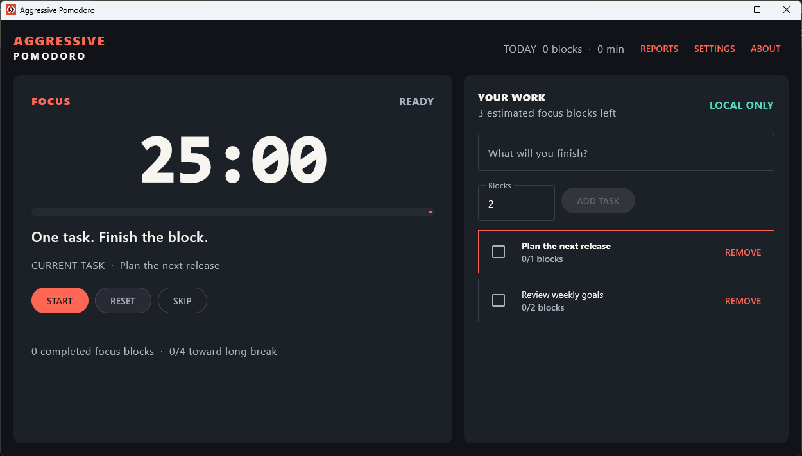
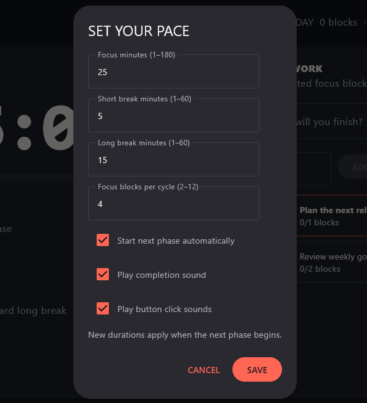
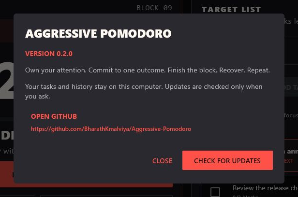
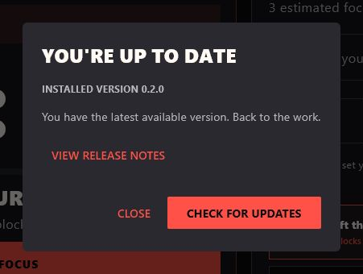

# Aggressive Pomodoro

Aggressive Pomodoro is a Windows desktop focus timer built with Kotlin and Compose Multiplatform. Commit to one outcome, finish the block, and take the break. An assertive timer, a multi-pulse alarm, and persistent completion reminders keep phase changes hard to miss.

**Downloads:** [v0.3.5 release](https://github.com/BharathKmalviya/Aggressive-Pomodoro/releases/tag/v0.3.5) includes the Windows installer, checksum, and license. Windows is the only packaged target at present.

Version 0.3.5 passed automated Windows build, all 138 tests, packaging, clean installation/launch, second-launch activation acknowledgement, upgrade preservation and a full download/reverification through the packaged updater code. The public MSI/checksum/license assets were independently downloaded and verified. Manual launcher focus, audio, saved close choices, tray/notification, keyboard/scaling, sleep and updater/UAC acceptance remains pending in [Testing](docs/TESTING.md).

## Screenshots

The Windows app in v0.2.0, captured from the running app with sample tasks and history in an isolated demo profile. Dialog screenshots are cropped for readability. Version 0.3.0 adds separate focus/break alarm previews and Reduce motion in Settings; the images below retain the previous release's version and Settings layout.

Live focus countdown, direct prompts, and the task earning the current block:



Duration rules, persistent reminders, independent sound controls, and alarm preview:



About includes the installed version and the GitHub repository link:



A manual check against GitHub confirms the installed release is current:



## Features

- Focus, short break, and long break phases. The default schedule is 25 / 5 / 15 minutes, with a long break after four completed focus blocks. Durations and transition behavior are configurable.
- Start, pause, resume, reset, and skip controls. Automatic transitions can be disabled when each next phase should wait for confirmation. Completion alerts remain visible until acknowledged.
- **Save rules** refreshes an unstarted block immediately. Running and paused blocks keep their remaining time; **Reset Block** reloads the latest saved duration for focus or either break. Saved preferences survive restart, including repair of stale unstarted durations from older versions. Fixed in v0.3.1.
- Aggressive reminders are enabled by default: pending completions repeat the alarm and request taskbar attention every ten seconds until reviewed. Disable reminders or completion sound independently in Settings; mute an alarm directly in its completion dialog. Use the alarm previews in Settings even when automatic completion sound is muted.
- High-contrast focus and break screens, direct phase instructions, an explicit paused state, and final-minute urgency. Reset/skip confirms before discarding running or paused progress, and confirmations expire when their phase ends.
- Local tasks with estimated focus blocks. A completed focus block is credited to the task selected when that block began; skipped blocks receive no credit.
- The timer distinguishes the task earning the current block from the task selected for the next one. Deleting the captured task preserves the timer and other saved work; marking it done still credits its completed block.
- Today's completed blocks and focused minutes, plus a report covering the current day and previous six calendar days. Reports use planned focus duration and the local date at completion.
- Original three-pulse completion sounds: an ascending chord when focus finishes and a sharper return-to-work cue when either break finishes. Version 0.3.2 adds all nine supplied sounds to **Settings → Focus completion sound / Break completion sound**, with separate saved choices and **TEST FOCUS ALARM / TEST BREAK ALARM** previews. Previews use your unsaved choice even when sound is muted; **Save Rules** keeps it across restarts, while Cancel discards edits and stops playback. Both break types share the break sound.
- Independent completion and button-click sounds, including a bundled [Kenney CC0 interface click](https://kenney.nl/assets/interface-sounds) that works offline. Alarm playback does not overlap, rapid click cues are throttled, and unavailable audio shows a visible explanation while the timer keeps working. Asset provenance is recorded in [sound credits](desktopApp/resources/sounds/README.md).
- Supplied alarm cues play for up to eight seconds per attempt, including reminders, and work offline. The original phase alarms remain the default. Source-input provenance and optional regeneration commands are in [sounds/README.md](sounds/README.md); normal builds need no audio conversion tools.
- Short phase-color transitions, status/instruction entrances, smooth elapsed progress, and a single final-minute emphasis. Countdown numbers and control positions stay immediate; **Settings → Reduce motion** disables custom motion and is saved across restarts.
- **About → Check for updates** finds newer stable Windows releases. Download with progress/cancel, then confirm **Install & Exit** to verify the installer, save and back up your session, and open Windows Installer. About also links directly to the GitHub repository.
- Version 0.3.5 fixes downloads stuck at 0% when one GitHub download-server address is unreachable. Connection/checksum/transfer/verification have distinct feedback, blocked requests can be cancelled, and **Download Again** retries a failed transfer. If an older updater cannot download the fix, obtain the MSI from the release page once, explicitly **Exit** the app and install it manually; your saved work is preserved. See [updater acceptance checks](docs/TESTING.md#updater-connection-correction-checks--2026-10-09).
- After checking, **View release notes** shows the latest stable release's notes inside the update dialog, even when you're up to date. Notes are selectable and scrollable; viewing them does not open GitHub. Added in v0.3.1.

By default, the window's **Close** button (or Alt+F4) offers **Run in background**, **Exit**, and **Cancel**, in every timer state. Background mode keeps the timer, alarms, and saving active; reopen using the launcher or the tray icon's **Open Aggressive Pomodoro** action. Its **Exit...** action brings back the same choice. If the tray is unavailable, **Minimize** keeps the app reachable from the taskbar. A background completion attempts a tray notification and retains its alert for when you reopen.

Version 0.3.3 expands the tray menu with live phase/time/status, today's completed blocks and minutes, **Start/Pause/Resume**, confirmed **Reset current block... / Skip current phase...**, saved **Alarm sound / Repeat completion reminders** checkboxes, and **Reports / Settings / About / Check for updates** shortcuts. Hover the icon for timer status. Pending completions offer **Review completed phase...**; Reset/Skip restores the timer's confirmation, and secondary shortcuts open the same app window. An existing update shows **View update...** without restarting its check/download or installing anything. Native labels use ordinary dots, including **Exit...**, to avoid the missing glyph shown by some Windows tray fonts. See [tray acceptance checks](docs/TESTING.md#expanded-tray-menu-checks--2026-10-09) for manual verification.

Version 0.3.3 also adds **Remember my choice** to the close dialog. Check it and choose Background/Minimize or Exit to use that action on later X/Alt+F4 requests. Cancel, Escape and dismissing the dialog never save. Change this through **Settings → When closing the window → Ask every time / Run in background / Exit the app → Save Rules**. Existing profiles default to Ask every time. Saved Background minimizes if the tray is unavailable; saved Exit waits for saving and stops alarms. Tray Exit always opens the choice, and relaunch always opens the app visibly. See [saved close checks](docs/TESTING.md#saved-close-choice-checks--2026-10-09).

Version 0.3.4 lets you reopen the existing app through its launcher, desktop or Start-menu shortcut, including while it is hidden or minimized; a normal second launch no longer shows Already running or starts another timer. It also corrects the disabled-looking tray while a close choice is open: tray actions cancel that uncommitted chooser and continue without remembering a choice. Timer status opens the app; today's totals open Reports. **Timer options** groups Reset/Skip, **Alerts** groups the saved sound/reminder checkboxes, and **Run in background** hides the window directly. Saving, installation and save errors have explanatory labels; **Keep app open** explicitly recovers from a failed exit save. Pending completions still require review before conflicting actions. See [tray and launcher correction checks](docs/TESTING.md#tray-usability-correction-checks--2026-10-09).

The timer continues while the window is minimized or running in the tray. Explicit **Exit** saves and stops the application; it cannot alert after exiting, and it does not block other applications.

## Run from source

Use Windows with JDK 21 available on `PATH`. The checked-in Kotlin Toolchain wrapper downloads its pinned build tool and dependencies on first use. In PowerShell, from the repository root:

```powershell
.\kotlin.bat build
.\kotlin.bat test
.\kotlin.bat run -m desktopApp
```

## Build a Windows package

The packaging script runs the build and tests, creates an app image with a bundled Java runtime, and checks that its process launches:

```powershell
.\scripts\package-windows.ps1
```

To create an MSI and `SHA256SUMS.txt`, install WiX 3.14.1 and put `candle.exe` and `light.exe` on `PATH`, then run:

```powershell
.\scripts\package-windows.ps1 -Msi
```

Output is written to `build/distribution/artifacts/`. Packaging does not publish a release. See the [release procedure](docs/RELEASING.md) for versioning, installer acceptance, and publication gates.

Obtain the MSI, checksum file, and MIT License from [GitHub Releases](https://github.com/BharathKmalviya/Aggressive-Pomodoro/releases). Compare the MSI's SHA-256 with `SHA256SUMS.txt` before installing. The installer is unsigned and may prompt a Windows publisher warning. No macOS or Linux native package is provided.

## Data and recovery

On Windows, the application stores its timer state, settings, tasks, and daily totals in `%APPDATA%\AggressivePomodoro\session.properties`. Changes are saved without blocking the UI. After a restart, an expired phase is completed once; missed cycles are not backfilled. If the saved file cannot be read, the application starts a fresh focus session and shows a recovery message. See [Architecture](docs/ARCHITECTURE.md) for the persistence and clock rules.

Version 0.2.0 migrates older snapshots to format 3. Close the app and back up the saved file before upgrading if you may downgrade: v0.1.0 cannot read the new format, so restore the pre-upgrade backup before launching it again.

Version 0.3.0 keeps snapshot format 3 and adds an optional saved Reduce motion preference. v0.2.0 can read the same session/tasks/history and ignores that extra preference. Back up the saved file before either upgrading or rolling back.

Version 0.3.2 keeps format 3 and adds optional focus/break sound choices. Earlier format-3 builds can read timer/tasks/history but may drop those choices when saving. Choose explicit **Exit** from the close prompt before backing up or upgrading.

Version 0.3.3 keeps format 3 and adds an optional saved window-close choice. Missing or unknown values keep Ask every time without discarding other data. Earlier builds ignore and may drop the choice when saving; back up your profile before upgrading or rolling back.

Only one instance can use the saved state at a time. The application has no account, telemetry, or cloud sync.

Update checks and downloads contact GitHub only when you request them. They do not send tasks, history, or timer data. Verified downloads are kept under `%APPDATA%\AggressivePomodoro\updates`; installation creates a uniquely named snapshot backup under `backups`. The Windows installer stays interactive, and you reopen the app after it finishes. If you restart before installing, download again so the current process can verify the installer.

## Project documentation

| Document | Contents |
| --- | --- |
| [Architecture](docs/ARCHITECTURE.md) | Module boundaries, timer rules, clocks, and persistence |
| [Windows acceptance checks](docs/TESTING.md) | Manual scenarios for UI, sound, recovery, and lifecycle behavior |
| [Release procedure](docs/RELEASING.md) | Packaging, checksums, CI gates, and publication |
| [Changelog](CHANGELOG.md) | Version history |
| [Contributing](CONTRIBUTING.md) | Issue, pull request, testing, and copyright guidance |
| [Community conduct](CODE_OF_CONDUCT.md) | Participation and reporting expectations |
| [Security policy](SECURITY.md) | Private vulnerability reporting |

## License

Aggressive Pomodoro is open source under the [MIT License](LICENSE). Copyright (c) 2026 Bharath Malviya. The license permits use, modification, and distribution, including commercial use, provided its notice is retained.

Third-party sound recordings retain their applicable licenses; see the bundled [sound credits](desktopApp/resources/sounds/README.md).

The updater's OkHttp/Okio libraries retain their Apache 2.0 license and [attribution](desktopApp/resources/licenses/NOTICE.txt), bundled in the app.
